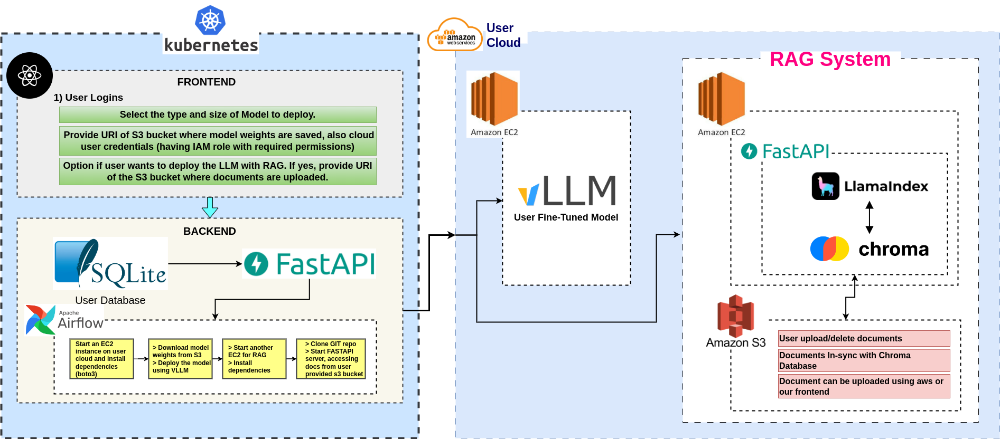
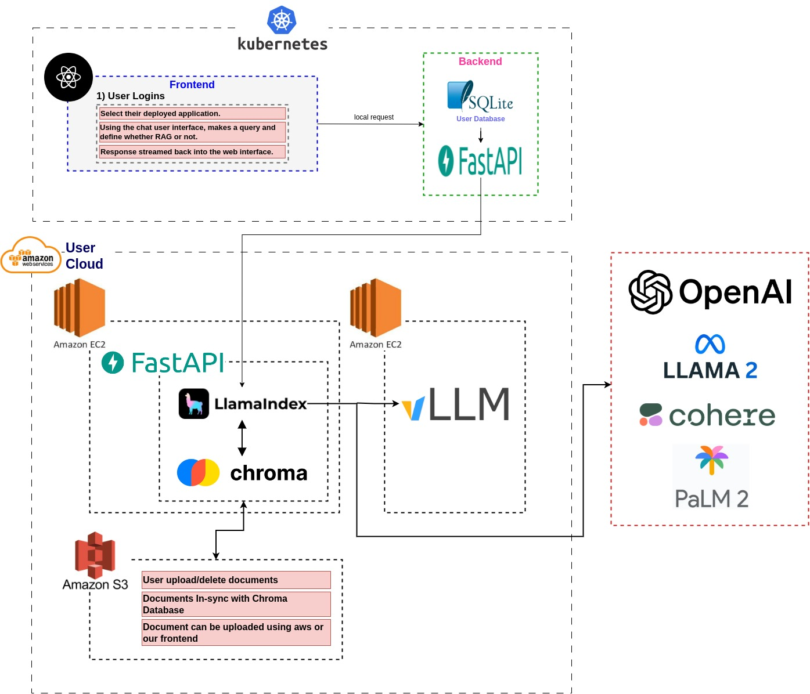

## How to use:

- Install docker and run the following docker image:
   - docker run -p 80:6000 ratna1sambhav/autollm-backend:0.1
- Access the api endpoint on localhost:80
  - Following are the endpoint:
    - localhost:80/deploy_rag/
      payload: {
         "access_key": "ADSWW...",               //Required: IAM Role with access to ec2 instance
         "secret_access_key": "cwedwe33232...",    //Required: IAM Role with access to ec2 instance
         "region_name": "ap-south-1",     //optional: Be default: ap-south-1, Options: [//any regions of aws]
         "ebs_volume": 30,               //optional: Be default: 30GB, Options: [//Any value, based on how large the data you have]
         "instance_type": "t2.large",    //optional: Be default: t2.large (8GB RAM), Options: [//all aws ec2 instance types, choose larger based on the size of embedding model]
         "instance_category": "spot"     //optional: Be default: spot, Options: ["on-demand", "spot"]
   }

    - localhost:80/fine_tune_model/
        payload: similar to above. //Still in progress

# AutoLLM

## An AI Platform for Fine-Tuning, Deploying, and Inferencing on LLMs with RAG

**Project Lead:** Dr. Rahul Dave

## Background and Motivation
First of all, this is a weekend project, so progress here is really slow. 
With the large-scale industry adoption of large language models, there is a high demand to train custom LLMs on private data. Proprietary LLM APIs often lack data privacy and secure deployment, making it challenging for non-tech companies to adopt this technology. This project aims to bridge this gap by introducing a UI that allows non-tech professionals to easily train and deploy their own LLMs, ensuring data privacy and cost-effectiveness.

## Scope and Objectives

The lack of a specialized no-code AI platform for non-tech personnel to train their LLMs is a challenge. Our AI platform, with an intuitive and easy user interface, aims to provide all the support needed for users to fine-tune their models effortlessly. The objectives include:

- Create automated pipelines for Fine-tuning, Model Deployment, and Inference.
- Develop a ReactJS frontend with a user login feature, interacting with a FastAPI backend.
- Utilize Infrastructure as Cloud service for resource-intensive tasks on GCP/AWS cloud.
- Showcase the system's functionality by fine-tuning and deploying 2b and 7b LLM models.

## Data Sources

**Source of Data:**
- <a href=https://huggingface.co/datasets/TIGER-Lab/MathInstruct>Math-Instruct</a> and <a href=https://huggingface.co/datasets/akjindal53244/Arithmo-Data>Arithmo-data  </a> datasets from HuggingFace. These are open source datasets.
- <a href=https://www.sec.gov/edgar/search/>EDGAR Database</a>: An online repository available for public access. Access to the EDGAR database is available for free on the SEC's official website (www.sec.gov/edgar).

**Description of Datasets:**
- <a href=https://huggingface.co/datasets/TIGER-Lab/MathInstruct>Math-Instruct</a> and <a href=https://huggingface.co/datasets/akjindal53244/Arithmo-Data>Arithmo-data  </a> datasets are basically instruction based Question-Answer datasets which contain queries and responses in chain-of-thought format.
- <a href=https://www.sec.gov/edgar/search/>EDGAR Database</a>(Electronic Data Gathering, Analysis, and Retrieval) is a comprehensive online repository maintained by the U.S. Securities and Exchange Commission (SEC) that provides public access to corporate financial filings, such as annual reports and registration statements. It can be accessed by using APIs.

**Key Attributes:**
- <a href=https://huggingface.co/datasets/TIGER-Lab/MathInstruct>Math-Instruct</a>:
  Instruction: MCQ type math related questions with instruction. 
  Output: Answer to the question with a chain-of-thought style solution.

- <a href=https://huggingface.co/datasets/akjindal53244/Arithmo-Data>Arithmo-data  </a>:
  Question: Algebra based questions.
  Answer: COmplete solution to the question in a chain-of-thought pattern.

- <a href=https://www.sec.gov/edgar/search/>EDGAR Database</a>:
  Text-based large set of documents.

**Relevance to the Project:**
- Math-Instruct and Arithmo-data will be used for fine-tuning the model using our architecture to ultimately deploy an LLM with pure mathematical skills.
- EDGAR Database: This will mainly validate the correct working of our RAG pipeline. Retrieval of the correct document from the database and correct response, all based on a single query will showcase an versatility of our platform and make it useful for real world scenarios.

## Data Handling after Building the Website and Pipelines

  Data Handling after building our website and all the necessary pipelines:
  Throughout the three stages of model training users can either choose data from our provided list or provide their own.
  For Unsupervised: User uploads documents (.pdf, .txt, .doc) or compressed files, text will be automatically extracted from there, processed and used for training.
  For Supervised: Users can either choose from the provided list (list from huggingface/kaggle) or upload their own dataset. 
  RLHF/RLAIF: Either choose from the defined sets or upload.

## Scope and Preliminary Design

### Fine-Tuning Architecture

### Deployment Architecture

### Inferencing Architecture

